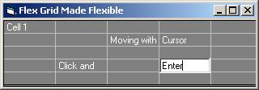



## Flex Grid Made Flexible

### Description

Flex Grid is Made to be More Flexible. A editable Flexgrid with textbox moving along to cells on a click or a cursor movement:)
 
### More Info
 
MSFLEX Grid Control Required

FlexGrid

             |
---                |---
**Submitted On**   |2004-01-23 13:34:02
**By**             |[Vijay Saki](https://github.com/Planet-Source-Code/PSCIndex/blob/master/ByAuthor/vijay-saki.md)
**Level**          |Advanced
**User Rating**    |4.5 (18 globes from 4 users)
**Compatibility**  |VB 6\.0
**Category**       |[Databases/ Data Access/ DAO/ ADO](https://github.com/Planet-Source-Code/PSCIndex/blob/master/ByCategory/databases-data-access-dao-ado__1-6.md)
**World**          |[Visual Basic](https://github.com/Planet-Source-Code/PSCIndex/blob/master/ByWorld/visual-basic.md)
**Archive File**   |[Flex\_Grid\_1698551232004\.zip](https://github.com/Planet-Source-Code/vijay-saki-flex-grid-made-flexible__1-51200/archive/master.zip)

